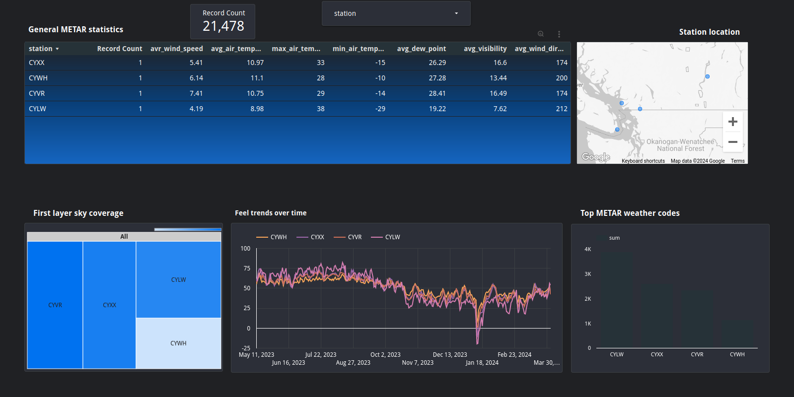

# METER-Weather-reports

## Technologies

         


- [ApacheSpark](https://spark.apache.org/): Batch-process and merge data from GCS buckets to BigQuery using DataProc.
- [BigQuery](https://cloud.google.com/bigquery): Host the materialized tables with aggregated data.
- [Dataproc](https://cloud.google.com/dataproc): GCP's Spark provider for batch processing from GCS bucket to BigQuery tables.
- [GCSBuckets](https://cloud.google.com/storage): For storing datasets and Spark scripts.
- [Mage](https://www.mage.ai/): For orchestrating ETL from API calls to GCS buckets.
- [PySpark](https://spark.apache.org/docs/latest/api/python/): Library for implementing Spark scripts.
- [Terraform](https://www.terraform.io/): For creating GCS buckets, BigQuery dataset and Dataproc clusters.
---

ApacheSpark: 
BigQuery
Dataproc
GCSBuckets
Mage
PySpark
Terraform


## About the project

An educational project to build an end-to-end pipline for near real-time and batch processing of data and visualisation.

The project is designed to enable the preparation of an analytical summary of the variability of METAR weather reports over the years for airports of European countries. 

The dataset is about Meteorological Aerodrome Reports ([METAR](https://www.dronepilotgroundschool.com/reading-aviation-routine-weather-metar-report/)) which are observations of current surface weather reported in a standard international format.

Here is the Looker Studio demo of the analysis using few stations: [CA_BC_ASOS](https://lookerstudio.google.com/reporting/cc8b1182-bd9e-49c1-9e38-d0feffd0cd0d)




Setup overview:


### Dataset

We will make API calls and save data to GCS buckets using parquet format with the following file path: `<network_name>/<station_name>/<station_name>.parquet`.

Here is a sample API call:
```python
https://mesonet.agron.iastate.edu/cgi-bin/request/asos.py?station=EPKK&data=all&year1=2023&month1=1&day1=1&year2=2023&month2=3&day2=26&tz=Etc%2FUTC&format=onlycomma&latlon=no&elev=no&missing=null&trace=T&direct=no&report_type=3&report_type=4
```

More details are in [doc/Dataset.md](doc/Dataset.md).

### Cloud
The project is developed in the cloud using scalable infrastructure provided by [Google Cloud Platform](https://cloud.google.com/). Infrastructure as Code (IaC) tools such as [Terraform](https://www.terraform.io/) are utilized to provision and manage the cloud resources efficiently.

### Data Ingestion
Data ingestion involves batch processing, where data is collected, processed, and uploaded to the data lake periodically and subsequently to the data warehouse. This ensures that the latest information on customers' meal choices, order values, and sales conversions is readily available for analysis.

### Workflow Orchestration
An end-to-end pipeline is orchestrated using [Mage](https://www.mage.ai/) to automate data workflows. This pipeline efficiently manages multiple steps in a Directed Acyclic Graph (DAG), ensuring seamless execution and reliability of the data processing tasks.

### Data Lake &  Data Warehouse
In this project, [Google Cloud Storage](https://cloud.google.com/storage) is used as the data lake where the data is initially stored after ingestion from the source. [Google BigQuery](https://cloud.google.com/bigquery) is used as the data warehouse and for storing and optimizing structured data for analysis. 

### Transformations
Data transformations are performed using [Apache Spark](ttps://spark.apache.org) via [DataProc](https://cloud.google.com/dataproc). The transformation logic is defined and executed via script using [PySpark](https://spark.apache.org/docs/latest/api/python) and executed in DataProc cluster.

### Dashboard

Finally a dashboard is then created using [Looker Studio](https://lookerstudio.google.com/) to visualize key insights derived from the processed data. The dashboard comprises of tiles that provide some insights into the customer actions, habits, and engagement with the hotel.

## Setting up the project

Clone this repo: `git clone git@github.com:prantoran/METER-Weather-reports.git`.

### GCP
- Set up a google cloud platform account.
- Create a GCP project and set up service account and authentication as per [these instructions](https://github.com/DataTalksClub/data-engineering-zoomcamp/blob/main/01-docker-terraform/1_terraform_gcp/2_gcp_overview.md#initial-setup).
- Setup Terraform in local environment. Check out terraform installation instructions [here](https://developer.hashicorp.com/terraform/tutorials/gcp-get-started/install-cli).
- See [terraform/README.md](terraform/README.md) for instructions where to copy the service account json credentials.
    - Rename the json to `service-acc-cred.json`.
    - Create a `keys` folder in root directory and copy the json to the folder.


### Terraform
Checkout [terraform/README.md](terraform/README.md).

### Mage

Checkout [mage/README.md](mage/README.md).

The contents of the Mage folder were copied from [github.com/mage-ai/maze-zoomcamp](https://github.com/mage-ai/mage-zoomcamp). In addition, [Dynamic blocks](https://docs.mage.ai/guides/blocks/dynamic-blocks) are used to trigger multiple instances of children blocks based on the number of stations returned by the API calls. After running `docker-compose up`, the Mage UI will be accessible in `localhost:6789`.

#### Mage blocks/tasks setup:


**Note**: If there are existing docker instances (i.e. Postgres):
- Remove the existing docker instances:
```bash
docker stop $(docker ps -aq)
docker rm $(docker ps -aq)
```
- Stop Postgresql service (e.g. in Ubuntu):
```bash
sudo systemctl stop postgresql
```


### Process from GCS Bucket to BigQuery using Dataproc/Spark
**Note:** According to the config in [terraform/dev.auto.tfvars](terraform/dev.auto.tfvars), adjust the bucket paths in [scripts/upload_pyspark_script_sql_to_gcs.sh](scripts/upload_pyspark_script_sql_to_gcs.sh) and [script/submit_dataproc_job.sh](script/submit_dataproc_job.sh).

#### Upload Pyspark script and sql commands:
```bash
./scripts/upload_pyspark_script_sql_to_gcs.sh
```

#### Submit jobs to Dataproc
```bash
./script/submit_dataproc_job.sh
```
- The desired station (i.e. `CA_BC_ASOS`) can be changed in [script/submit_dataproc_job.sh](script/submit_dataproc_job.sh).


### Analyze the generated BigQuery tables using Looker Studio
Here is a sample Looker dashboard: [CA_BC_ASOS](https://lookerstudio.google.com/reporting/cc8b1182-bd9e-49c1-9e38-d0feffd0cd0d).
- The plots are created using the generated BigQuery tables as data source by [running PySpark script](#submit-jobs-to-dataproc) in a job in DataProc cluster.
